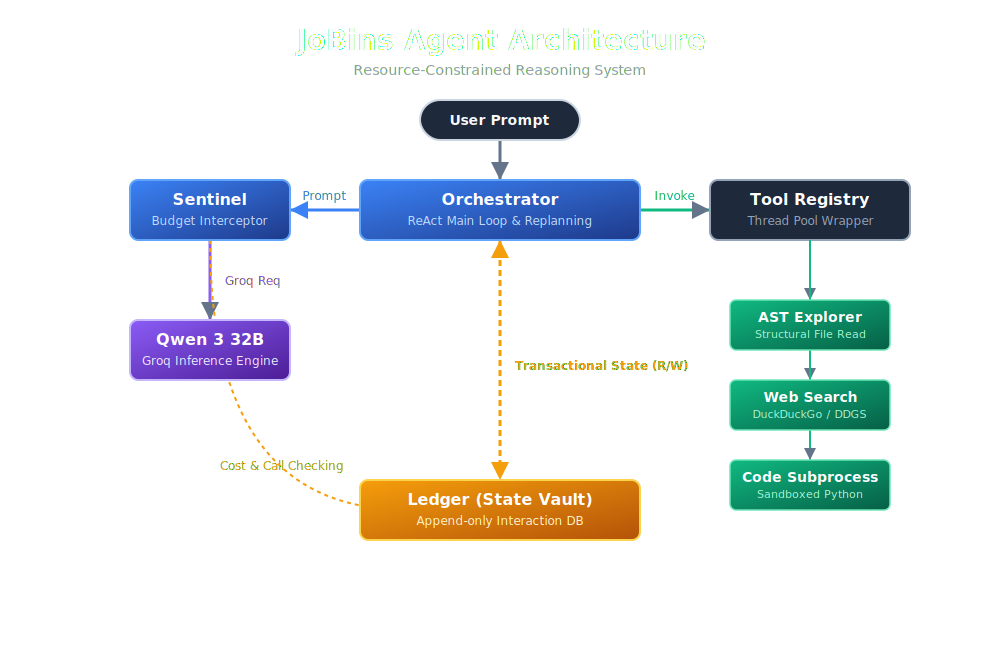

# JoBins Agent — Resource-Constrained Agentic Planning Loop

A robust, budget-aware AI agent that operates under strict resource limits (**10 LLM calls** and **$0.20 per task**) using a ReAct planning loop with reflection, replanning, and 3 hardened tools.

> **Run with a single command:**
> ```bash
> git clone https://github.com/Sazz-Sharma/Jobins-Agent.git && cd Jobins-Agent && chmod +x start.sh && ./start.sh "Your task here"
> ```

---

## Architecture Overview

The agent follows a **4-layer isolated architecture** where no component directly talks to the LLM or tools — every interaction is mediated through dedicated guardrail layers:



- **Orchestrator**: Coordinates the ReAct loop ticks, reflection, and replanning. Never touches the LLM directly.
- **Sentinel**: Proxy wrapper that enforces call count and cost limits *before* every LLM request. Raises `BudgetExceededException` to halt execution instantly.
- **Ledger**: Append-only transactional state database recording every thought, action, observation, error, and cost with timestamps.
- **Tool Registry**: Wraps every tool execution in `ThreadPoolExecutor` with forced timeouts. No bare `except: pass`.

---

## Planning Loop

**Choice: ReAct (Reason + Act)**

The agent uses a ReAct loop because it provides the strongest balance of reasoning transparency and action efficiency within our strict 10-call budget. Each tick produces an explicit `Thought → Action → Observation` trace that makes the agent's reasoning auditable.

**Biggest weakness**: ReAct can degenerate into repetitive loops when the model fixates on a failing strategy. We mitigate this with a dedicated **Progress Evaluator** that detects stalled progress (repeated observations or consecutive errors) and triggers a **Replanning Node** that clears the conversation context and forces the model to devise a completely different strategy.

---

## Schema Design

Data flows through the system as follows:

1. **User Task** (string) → enters the Orchestrator
2. **System Prompt** (dynamically built with current budget state and tool descriptions) + **Conversation History** (list of message dicts) → sent to Sentinel
3. **Sentinel** checks Ledger counters → either raises `BudgetExceededException` or forwards to the LLM Client
4. **LLM Response** → `<think>` tags stripped by LLM Client → parsed by `parser.py` into a `ParsedResponse` dataclass (thought, action, action_input, final_answer)
5. **Tool Execution** → dispatched through the Tool Registry with timeout wrapping → returns observation string
6. **Ledger Entry** → every step is appended as an immutable `LedgerEntry` (Pydantic model with timestamp, type, content, tokens, cost)

State is **never mutated** — only appended to the Ledger. This guarantees deterministic budget checking and clean partial-execution dumps during graceful exits.

---

## Prompt Strategy

The system prompt is **dynamically regenerated** every tick with:
- **Current budget state**: exact remaining calls and dollars, so the model can self-regulate
- **Tool catalog**: names and descriptions of all registered tools
- **Strict format enforcement**: the model must respond in `Thought: / Action: / Action Input:` or `Thought: / Final Answer:` format

When progress stalls, the standard system prompt is replaced with a **Replanning Prompt** that:
- Lists all previously tried actions (so the model won't repeat them)
- Forces explicit failure analysis before any new action
- Provides remaining budget as a hard constraint on the new plan

### Replanning Trace Example
The agent prevents loop traps using a deterministic reflection node. If the model attempts a duplicate action or repeats the same error, it blocks the LLM and forces a hard reset of its local context:

```text
  THOUGHT: I am stuck in a loop.     
  DUPLICATE ACTION BLOCKED: test_tool
     Input: trigger

  ========================================================
    REPLANNING TRIGGERED                 
  ========================================================
     Reason: Progress stalled (2 consecutive stalls)             
     Previously tried actions:                 
       • test_tool:trigger                   
     Strategy: Clearing conversation context and injecting fresh strategy prompt     
     Remaining budget: 7 calls, $0.200000                        
     Replan complete — fresh context injected              
  ========================================================

  THOUGHT: I am replanning.          
  FINAL ANSWER: Done! 
```

---

## Failure Modes

**Observed failure: Format compliance degradation under pressure**

When the model approaches its call limit (e.g., call 8 of 10), it sometimes attempts to pack multiple actions into a single response or produces malformed output that doesn't follow the `Thought/Action/Action Input` format. The parser handles this gracefully by returning a `parse_error` observation that instructs the model to try again in the correct format — but this burns a call. In adversarial scenarios designed to waste calls, this can compound with the budget limit to prevent task completion.

---

## Future Work

**Known limitation: Single-model architecture**

The current implementation routes all LLM calls through a single model (Qwen 3 32B). With more time, I would implement a **dual-model strategy**: a lightweight, cheap model for planning and reflection ticks, and reserve a more capable model for final synthesis and complex reasoning. This would dramatically stretch the budget by reducing the cost-per-call for routine planning steps while maintaining output quality for critical decision points.

---

## Setup & Usage

### Prerequisites
- Docker and Docker Compose
- A Groq API key ([get one free at console.groq.com](https://console.groq.com))

### Quick Start (One-Command Setup)

You can clone, configure, build, and run the agent using a single command. The setup script will automatically handle `.env` creation, prompt you for your Groq API key if you haven't set it, and cleanly pass your task straight into the Docker container.

```bash
git clone https://github.com/Sazz-Sharma/Jobins-Agent.git && cd Jobins-Agent && chmod +x start.sh && ./start.sh "Calculate the first 20 Fibonacci numbers"
```

3. **Run locally (alternative):**
   ```bash
   pip install -r requirements.txt
   python main.py                              # Interactive mode
   python main.py --task "Your task here"       # Single task mode
   ```

### Environment Variables

| Variable | Default | Description |
|---|---|---|
| `GROQ_API_KEY` | *(required)* | Your Groq API key |
| `GROQ_MODEL` | `qwen/qwen3-32b` | Model identifier on Groq |
| `MAX_LLM_CALLS` | `10` | Hard limit on LLM calls per task |
| `MAX_BUDGET_USD` | `0.20` | Hard limit on simulated cost per task |

### Mock Pricing

Since Groq's free tier has no real billing, we simulate token costs to demonstrate the budget enforcement pipeline:
- **$0.00075** per 1k input tokens
- **$0.0045** per 1k output tokens
- (Mirrors GPT-5.4-mini reasoning model pricing)

### Tools

| Tool | Description |
|---|---|
| `web_search` | DuckDuckGo search with 5s timeout |
| `code_execution` | Sandboxed Python subprocess with 30s timeout |
| `ast_code_map_explorer` | AST-based structural code analysis (no implementation bodies) |
